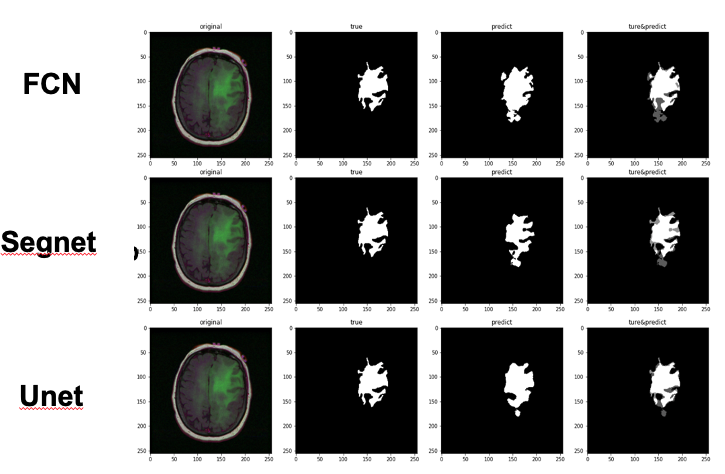
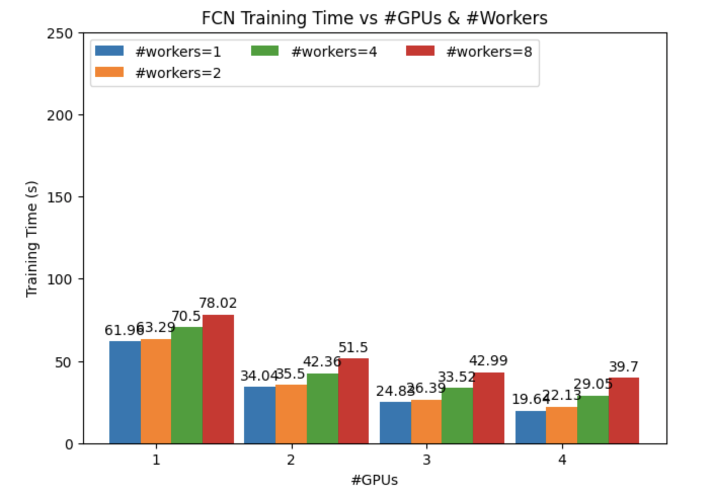
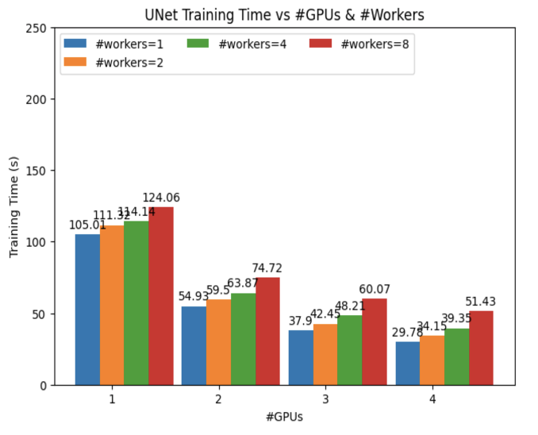
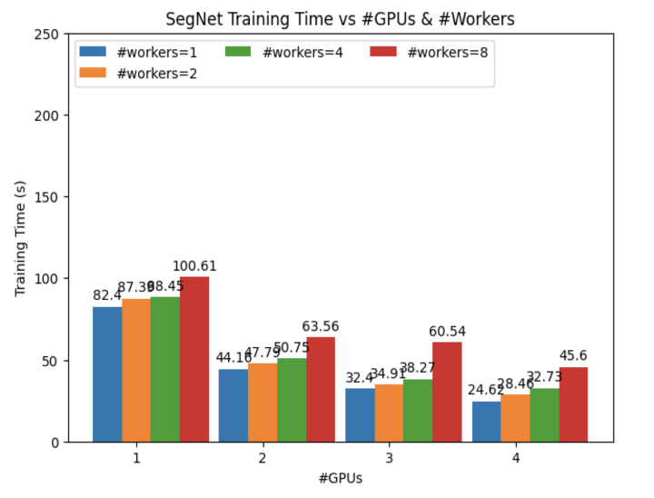

# HPML_Project
Shuai Zhang (sz3714)
Melody Qu (mq2088)

## A description of the project
The goal of the project is to conduct a comparative analysis of optimization techniques applied to image segmentation models(such as FCN, Unet, Segnet, etc.). Through this analysis, find accurate and efficient image segmentation models that can be applied in medical image dataset.

## Code structure
```
├── FCN                     // fcn model
├── Segnet                  // segnet model
├── Unet                    // unet model
├── lgg-mri-segmentation    // dataset
├── result                  // result
```

## Commands to execute the code        
run this script in NYU HPC
you need modified the dataset dir in the model code
```
#!/bin/bash

#SBATCH --cpus-per-task=4
#SBATCH --time=2:00:00
#SBATCH --mem=64GB
#SBATCH --gres=gpu:4
#SBATCH --job-name=torch
#SBATCH --output="%A\_%x.txt"
#SBATCH --account=ece_gy_9143-2023sp
#SBATCH --partition=n1c24m128-v100-4

echo "GPU: $(nvidia-smi -q | grep 'Product Name')"

singularity exec --nv \
	    --overlay /scratch/sz3714/pytorch-example/my_pytorch.ext3:ro \
	    /share/apps/images/cuda11.6.124-cudnn8.4.0.27-devel-ubuntu20.04.4.sif\
	    /bin/bash -c "source /ext3/env.sh; python fcn.py"
```

## Results
### base model

| Network | MIoU   |
|---------|--------|
| FCN     | 80.95% |
| U-Net   | 83.40% |
| SegNet  | 78.02% |

### optimization






- Using DistributedDataParallel to train models on multiple GPUs does help decrease training time a lot for all 3 models.
- When using 0 worker in DataLoader, the training time is cut to about half when using 2 GPUs; but from 2-4 GPUs, training time increases tremendously.
- Training time for all 3 models decreases as # of GPUs increases when # of workers in DataLoader is not 0.
- Training time for all 3 models increases as # of workers in DataLoader increases.


DistributedDataParallel allows for the parallelization of model training across multiple GPUs. This parallelization can significantly reduce the training time for large models and datasets.  

When setting num_workers to 0 (the default), data loading is performed in the main process. This can slow down training because the GPU might need to wait for data to be loaded before it can proceed with the next iteration.  

When setting num_workers to a number greater than 0, that many subprocesses will be used to load data in parallel. While the GPU is processing one batch of data, the next batch can be loaded by one of the worker processes. This can reduce or eliminate the time the GPU spends waiting for data, which can lead to faster training times.  

Each worker process consumes some amount of CPU memory, and there is some overhead involved in coordinating between the worker processes. If num_workers is set too high, these factors can actually slow down data loading or lead to out-of-memory errors.

